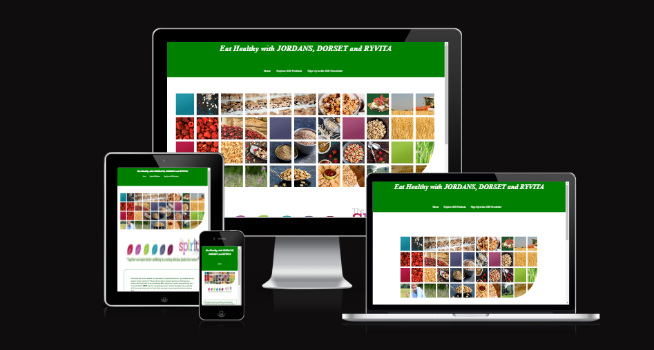

# EAT HEALTHY WITH JDR

[Visit the website here](https://mikyrenato.github.io/1st-Project-Eat-Healty-With-JDR/jdrhome)

I created this page to give the reader a better understanding about my company, Jordans, Dorset and Ryvita and to promote a healthier life style, full in fibre.
---
This website is made up of the following sections:

1. Home page;
2. Explore page;
3. Sign up page to the JDR Newsletter;
4. Thank you for signing up page.
---
The business goals for this website are:

1. To advise users on how to eat healthy;
2. To inspire users by giving them cooking tips and ideas;
3. To promote my company.

The user goals of this website are:
1. As a first-time visitor, I want to easily find useful information & tips about oour food and recipes;
2. As a first-time user, I want to be able to sign up to directly receive content via a newsletter.

## UX
---
### **Strategy**

Considering the core UX principles I first started to think about the strategy for this website and defined who the target users would be and what features/technologies they would want.

JDR's target users are:
* Aged 30+
* People interested in living a heathier lifestyle;
* People who already living a healthy lifestyle.

What these users would be looking for:
* Clear, concise, easy-to-find information;
* Beautiful photos that provide inspiration and make the food look delicious;
* Recommendations for what to eat.

This website will offer all of these things whilst also allowing for intuitive navigation and comfortability of use. An effort was taken to not provide an overwhelming amount of information at first glance as this is often the reason people are put off with this kind of websites. It is assumed that most users will be viewing the site on their mobile phones and therefore creating something responsive is integral to the design.

### **Scope**

In order to achieve the desired user & business goals, the following features will be included in this release:

- Header and menu bar, to navigate to various sections of the page;
- Gallery of images and videos with some of our delicious products;
- Newsletter sign up form;
- Links to affiliate social media pages.

### **Structure** 

This is a four pages website. First page is the home page, which will give the users enough information about what our business is doing; the navigation bar at the top allows for users to easily move to whatever page of the site they are interested in or they can scroll down where our social links can be found. I chose the following order for the information 'Home > Explore JDR Products > Sign up to the JDR Newsletter, whcih after submitting will send you to a thank you page', as I felt this would allow the information to be digested in the best way. The second page is the "Explore JDR Products", which will contain videos from all our three brands, pictures with some delicious ideas of toppings and recipes followed by the social media links at the bottom. Finally, there is a simple sign up form for users to sign up to the JDR newsletter.

### **Skeleton**

Whilst building the website, at first I added random pictures with all our branded products, later I realsied that it was not easy to understand what all our brands mean and what products they are offerning, than I decided to organise and have sections with videos followed by pictures for each brand and I believe it looks much better now and it makes more sense.

### **Surface**

I chose a colour palette based around green & white as these colours remind me of the nature and it's in line with our new motto: "Together we inspire better wellbeing by creating delicious foods from nature".

---

## **Features**

This is a fully responsive website that was designed for all devices like laptops, desktops, tablets and mobile phone. 

### *Navbar*
The navbar is placed on the middle of the header and it turns into a dropbox for smaller screen sizes.

### *Home page paragraph*
This is where I introduce the JDR company with a short paragraph: "At Jordans Dorset Ryvita, we’re all about helping people around the world live healthier lives whilst minimising our impact on the world around us, and it’s our three brilliant brands that allow us to do this. Be it Jordans Cereals, Dorset Cereals or Ryvita: all three make great tasting, honest real food which we’re really proud of.", followed by an animated image, the company's motto and our social media links.

### *Explore JDR Page*
This page starts with another paragraph about our company:"At Jordans Dorset Ryvita, we have a strong heritage of making whole grain foods and working with farmers to protect the countryside. Ever since our brands first came together, we have continued to act on these values. We believe that natural foods that have been lightly processed are generally better for you –they tend to be higher in fibre, vitamins and minerals, and they taste great too! Our Brands have a long-standing commitment to health and sustainability, and we have so much to be proud of.", followed by some beautiful images and videos about our products and the social media links.

### *Sign up to the JDR Newsletter page*
This page is about signing up to our JDR Newsletters which will redirect the user to another "Thank you for signing up page".

---
## Technologies Used 

I have used several technologies that have enabled this design to work:

- [HTML](https://developer.mozilla.org/en-US/docs/Web/HTML)
    - Used as the basic building block for the project and to structure the content.
- [CSS](https://developer.mozilla.org/en-US/docs/Learn/Getting_started_with_the_web/CSS_basics)
    - Used to style all the web content across the project. 
- [Font Awesome](https://fontawesome.com/)
    - Used to obtain the social media icons used in the footer.
- [Google Developer Tools](https://developers.google.com/web/tools/chrome-devtools)
    - Used as a primary method of fixing spacing issues, finding bugs, and testing responsiveness across the project.
- [GitHub](https://github.com/)
    - Used to store code for the project after being pushed.
- [Git](https://git-scm.com/)
    - Used for version control by utilising the Gitpod terminal to commit to Git and Push to GitHub.
- [Gitpod](https://www.gitpod.io/)
    - Used as the development environment.
- [W3C Markup Validation Service](https://validator.w3.org/) 
    - Used to validate all HTML code written and used in this webpage.
- [W3C CSS Validation Service](https://jigsaw.w3.org/css-validator/#validate_by_input)
    - Used to validate all CSS code written and used in this webpage.
- [AmIResponsive](http://ami.responsivedesign.is/)
    - Used to generate repsonsive image used in README file.

---

## Deployment

I deployed this website by using GitPages and following the below steps:

*GitHub pages deployment* 

1. Log in to GitHub
2. In your Repository section, select the project repository that you want to deploy
3. In the menu located at the top of this section, click 'Settings'
4. Select 'Pages' on the left-hand menu - this is around halfway down
5. In the source section, select branch 'Master' and save
6. The page is then given a site URL which you will see above the source section, it will look like the following: 

Please note it can take a while for this link to become fully active. 

*Forking the GitHub Repository*

If you want to make changes to your repository without affecting it, you can make a copy of it by 'Forking' it. This ensures your original repository remains unchanged.

1. Find the relevant GitHub repository
2. In the top right corner of the page, click the Fork button (under your account)
3. Your repository has now been 'Forked' and you have a copy to work on

*Cloning the GitHub Repository*

Cloning your repository will allow you to download a local version of the repository to be worked on. Cloning can also be a great way to backup your work.

1. Find the relevant GitHub repository
2. Press the arrow on the Code button
3. Copy the link that is shown in the drop-down
4. Now open Gitpod & select the directory location where you would like the clone created
5. In the terminal type 'git clone' & then paste the link you copied in GitHub
6. Press enter and your local clone will be created.

---
## Credits

I have used a number of resources to produce this website, where code has been used found from another source this is credited as a comment within the HTML, CSS.

The following websites/articles were used for research and guidance:

- Inspired myself from the Love running project for the animated image from the home page, creating the nav bar, creating the social media links.

- [Responsive Navbar](https://www.w3schools.com/howto/howto_js_topnav_responsive.asp)

- [Sign up form](https://www.youtube.com/watch?v=n6sv__UBwIA), I used this code as the basis of my form but changed the styling. 

- Most of the images and social media links I got from my company which can also be found now online.

- The structure of the readme file was taken from: [La Petite Traveller](https://daisygunn.github.io/la-petite-traveller/).

---
## Acknowledgements

I would like to thank my course mentor Harry Dhillon for his support and guidance throughout the course of the project and my fellow student Bartosz Fraszczyk, my collegue Marcin Placek and my boss Marcin Dorozynski for their support & feedback.
